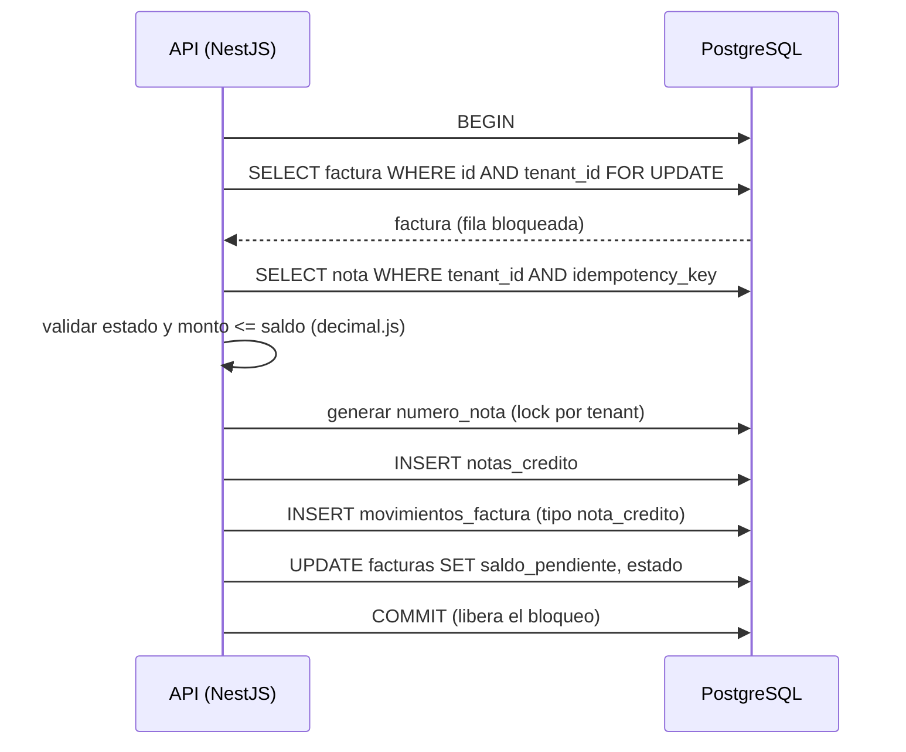

# Notas de crédito sobre facturas — Diseño

Una **nota de crédito** reduce el saldo pendiente de una factura emitida
(devolución, descuento, error de facturación). Este documento explica el modelo
de datos y **cómo ocurre cada proceso** paso a paso.

## Índice

1. [Principios](#1-principios)
2. [Modelo de datos](#2-modelo-de-datos)
3. [Proceso: identificación del tenant](#3-proceso-identificación-del-tenant)
4. [Proceso: crear una nota de crédito](#4-proceso-crear-una-nota-de-crédito)
5. [Proceso: anular una nota de crédito](#5-proceso-anular-una-nota-de-crédito)
6. [Proceso: consultas](#6-proceso-consultas)
7. [Concurrencia: solicitudes simultáneas](#7-concurrencia-solicitudes-simultáneas)
8. [Idempotencia: reintentos del cliente](#8-idempotencia-reintentos-del-cliente)
9. [Fallos a mitad del proceso](#9-fallos-a-mitad-del-proceso)
10. [Numeración de notas](#10-numeración-de-notas)
11. [Trazabilidad](#11-trazabilidad)
12. [Estados](#12-estados)
13. [Carga inicial del histórico y conciliación](#13-carga-inicial-del-histórico-y-conciliación)
14. [Errores](#14-errores)

---

## 1. Principios

| Principio | Regla |
|-----------|-------|
| Multi-tenant | El `tenant_id` sale **solo del JWT**. Todo query filtra por `tenant_id`. Lo que es de otro tenant responde `404`. |
| Dinero exacto | `NUMERIC` en BD, `string` en TypeScript, cálculos con `decimal.js` (`src/common/utils/money.util.ts`). Nunca `float` ni `number`. |
| Atomicidad | Cada operación que mueve saldo es **una sola transacción**: o se guarda todo o nada. |
| Serialización | La fila de la factura se bloquea con `SELECT … FOR UPDATE` antes de leer su saldo. |
| Inmutabilidad | Las notas no se editan ni se borran: se **anulan**. Los movimientos solo se insertan. |
| Trazabilidad | Cada nota y movimiento guarda quién, cuándo, desde dónde y en qué request. |

---

## 2. Modelo de datos

```
tenants ─┬─< users
         └─< facturas ─┬─< notas_credito
                       └─< movimientos_factura >── notas_credito
```

- **`facturas`** (existente, `docker/postgres/init/001_schema.sql`): guarda el
  saldo **actual** en `saldo_pendiente`. Sus `CHECK` impiden saldo negativo o
  mayor al total.
- **`notas_credito`**: el documento. Una fila por nota.
- **`movimientos_factura`**: el **histórico**. Una fila por cada cambio de
  saldo, con saldo antes y después. Permite reconstruir cómo llegó la factura
  a su saldo actual.

> Orden de creación: `notas_credito` primero, porque `movimientos_factura` la
> referencia.

### 2.1 `notas_credito`

```sql
CREATE TABLE notas_credito (
    id UUID PRIMARY KEY DEFAULT gen_random_uuid(),

    tenant_id UUID NOT NULL
        REFERENCES tenants(id),

    factura_id UUID NOT NULL
        REFERENCES facturas(id),

    numero_nota VARCHAR(30) NOT NULL,

    monto NUMERIC(18,2) NOT NULL
        CHECK (monto > 0),

    motivo VARCHAR(255) NOT NULL,

    descripcion TEXT,

    estado VARCHAR(20) NOT NULL DEFAULT 'emitida'
        CHECK (estado IN ('emitida', 'anulada')),

    idempotency_key VARCHAR(100) NOT NULL,

    created_by UUID NOT NULL
        REFERENCES users(id),

    created_at TIMESTAMPTZ NOT NULL DEFAULT now(),

    updated_at TIMESTAMPTZ NOT NULL DEFAULT now(),

    ip_address INET,

    user_agent TEXT,

    request_id UUID,

    correlation_id UUID,

    CONSTRAINT uq_notas_credito_tenant_numero
        UNIQUE (tenant_id, numero_nota),

    CONSTRAINT uq_notas_credito_tenant_idempotency
        UNIQUE (tenant_id, idempotency_key)
);

CREATE INDEX idx_notas_credito_tenant_factura
    ON notas_credito(tenant_id, factura_id);

CREATE INDEX idx_notas_credito_created_at
    ON notas_credito(created_at);
```

### 2.2 `movimientos_factura`

```sql
CREATE TABLE movimientos_factura (
    id UUID PRIMARY KEY DEFAULT gen_random_uuid(),

    tenant_id UUID NOT NULL
        REFERENCES tenants(id),

    factura_id UUID NOT NULL
        REFERENCES facturas(id),

    nota_credito_id UUID
        REFERENCES notas_credito(id),

    tipo VARCHAR(30) NOT NULL
        CHECK (
            tipo IN (
                'emision',
                'pago',
                'nota_credito',
                'anulacion_nota_credito',
                'ajuste'
            )
        ),

    monto NUMERIC(18,2),

    saldo_anterior NUMERIC(18,2)
        CHECK (saldo_anterior >= 0),

    saldo_posterior NUMERIC(18,2)
        CHECK (saldo_posterior >= 0),

    descripcion TEXT,

    created_by UUID NOT NULL
        REFERENCES users(id),

    created_at TIMESTAMPTZ NOT NULL DEFAULT now(),

    ip_address INET,

    user_agent TEXT,

    request_id UUID,

    correlation_id UUID,

    metadata JSONB
);

CREATE INDEX idx_movimientos_factura
    ON movimientos_factura(tenant_id, factura_id, created_at);

CREATE INDEX idx_movimientos_nota_credito
    ON movimientos_factura(tenant_id, nota_credito_id);

CREATE INDEX idx_movimientos_created_at
    ON movimientos_factura(created_at);
```

**Convención de `monto` en movimientos**: siempre positivo; el `tipo` indica
la dirección.

| Tipo | Efecto en saldo |
|------|-----------------|
| `emision` | `saldo_posterior = monto` (saldo inicial) |
| `pago`, `nota_credito` | `saldo_posterior = saldo_anterior - monto` |
| `anulacion_nota_credito` | `saldo_posterior = saldo_anterior + monto` |
| `ajuste` | Cualquier dirección; se explica en `descripcion` y `metadata` |

---

## 3. Proceso: identificación del tenant

Ocurre en **cada** request, antes de tocar datos.

1. El cliente hace login (`POST /auth/login`) y recibe un JWT con
   `{ sub: userId, tenantId, email }`, firmado con `JWT_SECRET`.
2. En cada request envía `Authorization: Bearer <token>`.
3. `JwtAuthGuard` verifica firma y expiración. Si falla → `401`.
4. `JwtStrategy` deja `{ userId, tenantId, email }` en `request.user`.
5. El controller lo recibe con `@CurrentUser()` y pasa `tenantId` y `userId`
   al servicio.
6. El servicio usa ese `tenantId` en **todos** los `WHERE`.

El cliente **no puede elegir** el tenant: no existe campo `tenantId` en ningún
DTO, y si intentara enviarlo el `ValidationPipe` lo descarta. Como el token
está firmado, modificar el `tenantId` dentro del JWT invalida la firma.

---

## 4. Proceso: crear una nota de crédito

**Entrada**: `facturaId`, `monto` (string, ej. `"150000.25"`), `motivo`,
`descripcion` opcional y header `Idempotency-Key`.

### 4.1 Validaciones antes de la transacción (sin tocar BD)

1. `monto` es string con formato `^\d{1,12}(\.\d{1,2})?$` y es mayor que cero.
   `"100.005"`, `-5`, `0` o un `number` JSON → `400`. **No se redondea.**
2. `Idempotency-Key` presente (máx. 100 caracteres) → si falta, `400`.
3. `facturaId` es UUID válido → si no, `400`.

### 4.2 Transacción



Paso a paso:

| # | Paso | Qué protege |
|---|------|-------------|
| 1 | `BEGIN` y `SET LOCAL lock_timeout = '5s'` | Que una espera no se vuelva infinita. |
| 2 | `SELECT * FROM facturas WHERE id = :facturaId AND tenant_id = :tenantId FOR UPDATE` | Aislamiento por tenant (si no existe → `404`) y bloqueo de la fila: nadie más puede cambiar este saldo hasta el `COMMIT`. |
| 3 | Buscar nota con `(tenant_id, idempotency_key)` | Si ya existe, es un reintento: se devuelve esa nota sin crear otra ([sección 8](#8-idempotencia-reintentos-del-cliente)). |
| 4 | Validar `estado <> 'anulada'` | No se acredita una factura anulada → `409`. |
| 5 | Validar `monto <= saldo_pendiente` con `decimal.js` | El saldo nunca queda negativo → `422`. |
| 6 | Calcular `saldo_posterior = saldo_pendiente - monto` con `decimal.js` | Cálculo exacto, sin coma flotante. |
| 7 | Generar `numero_nota` ([sección 10](#10-numeración-de-notas)) | Consecutivo único por tenant. |
| 8 | `INSERT INTO notas_credito` con datos de trazabilidad | Documento creado. |
| 9 | `INSERT INTO movimientos_factura` (`tipo = 'nota_credito'`, `saldo_anterior`, `saldo_posterior`, `nota_credito_id`) | Histórico del cambio. |
| 10 | `UPDATE facturas SET saldo_pendiente = :saldoPosterior, estado = :estado, updated_at = now() WHERE id = :facturaId AND tenant_id = :tenantId AND saldo_pendiente = :saldoAnterior` | La guarda `saldo_pendiente = :saldoAnterior` es una segunda defensa: si afecta 0 filas → `ROLLBACK`. |
| 11 | `COMMIT` | Todo queda visible a la vez y se libera el bloqueo. |

**Salida**: `201` con la nota, `saldoAnterior` y `saldoPosterior` de la factura.

---

## 5. Proceso: anular una nota de crédito

Anular **no borra** la nota: cambia su estado y devuelve el monto al saldo de
la factura, dejando un movimiento que lo explica.

**Entrada**: `notaId`, `motivo` de la anulación.

| # | Paso |
|---|------|
| 1 | `BEGIN` |
| 2 | `SELECT factura_id FROM notas_credito WHERE id = :notaId AND tenant_id = :tenantId` → si no existe, `404`. |
| 3 | Bloquear **primero la factura** (`FOR UPDATE`) y **luego la nota** (`FOR UPDATE`). Siempre en este orden para evitar deadlocks con el proceso de creación. |
| 4 | Validar `nota.estado = 'emitida'` → si ya está `anulada`, `409`. |
| 5 | Calcular `saldo_posterior = saldo_pendiente + monto` con `decimal.js`. El `CHECK saldo_pendiente <= monto_total` de `facturas` impide pasarse del total. |
| 6 | `UPDATE notas_credito SET estado = 'anulada', updated_at = now() WHERE id AND tenant_id` |
| 7 | `INSERT INTO movimientos_factura` (`tipo = 'anulacion_nota_credito'`, mismo `nota_credito_id`, motivo en `descripcion`, quién anuló en `created_by`). |
| 8 | `UPDATE facturas` con el nuevo saldo y estado (misma guarda del paso 10 de creación). |
| 9 | `COMMIT` |

Quién y cuándo anuló queda en el movimiento `anulacion_nota_credito`
(`created_by`, `created_at`, `ip_address`, `request_id`).

Para **corregir** una nota mal emitida: se anula y se crea una nueva. Ambas
quedan en el historial.

---

## 6. Proceso: consultas

Las consultas no bloquean ni modifican nada; siempre filtran por `tenant_id`.

| Consulta | Query base |
|----------|-----------|
| Notas del tenant | `SELECT … FROM notas_credito WHERE tenant_id = :t ORDER BY created_at DESC` (paginado) |
| Una nota | `WHERE id = :id AND tenant_id = :t` → si no existe, `404` |
| Notas de una factura | `WHERE tenant_id = :t AND factura_id = :f` (usa `idx_notas_credito_tenant_factura`) |
| Histórico de una factura | `SELECT … FROM movimientos_factura WHERE tenant_id = :t AND factura_id = :f ORDER BY created_at` (usa `idx_movimientos_factura`) |

Los montos se devuelven como **string** con 2 decimales.

---

## 7. Concurrencia: solicitudes simultáneas

**Escenario**: factura con saldo `100.00`. Llegan al mismo tiempo dos
solicitudes de nota por `80.00`.

| Tiempo | Solicitud A | Solicitud B |
|--------|-------------|-------------|
| t1 | `SELECT … FOR UPDATE` → obtiene el bloqueo, lee saldo `100.00` | `SELECT … FOR UPDATE` → **espera** |
| t2 | Valida `80 <= 100` ✔ | (esperando) |
| t3 | Inserta nota y movimiento, saldo → `20.00` | (esperando) |
| t4 | `COMMIT` → libera bloqueo | Obtiene el bloqueo, lee saldo **`20.00`** |
| t5 | | Valida `80 <= 20` ✘ → `ROLLBACK`, responde `422` |

**Resultado**: saldo final `20.00`, una sola nota. Sin el `FOR UPDATE`, ambas
leerían `100.00` y la factura quedaría en `-60.00` (o una fallaría en el
`CHECK` sin explicación clara).

Defensas en capas:

1. **`FOR UPDATE`** sobre la factura: serializa las operaciones de una misma
   factura. Facturas distintas se procesan en paralelo sin esperar.
2. **Guarda en el `UPDATE`** (`AND saldo_pendiente = :saldoAnterior`): si por un
   bug se omitiera el bloqueo, el `UPDATE` no afecta filas y se hace rollback.
3. **`CHECK` de `facturas`**: la BD rechaza saldo negativo o mayor al total
   pase lo que pase en el código.
4. **Orden fijo de bloqueos** (factura → nota → numeración): evita deadlocks.
5. **`lock_timeout`**: si la espera supera 5 s se responde `409` y el cliente
   puede reintentar con la misma `Idempotency-Key`.

---

## 8. Idempotencia: reintentos del cliente

**Problema**: el cliente envía la solicitud, la nota se crea, pero la respuesta
se pierde por la red. El cliente reintenta. Sin protección se crearían dos
notas y se descontaría dos veces.

**Proceso**:

1. El cliente genera un UUID por **intención** de crear una nota y lo envía en
   `Idempotency-Key`. Si reintenta, envía **la misma** key.
2. Dentro de la transacción, después de bloquear la factura, se busca
   `(tenant_id, idempotency_key)`:
   - **No existe** → se crea la nota normalmente.
   - **Existe y es sobre la misma factura y el mismo monto** → se responde
     `200` con la nota existente. No se toca el saldo.
   - **Existe con otros datos** → `409` (la key se está reutilizando para otra
     operación).
3. Si dos reintentos llegan al mismo tiempo, el bloqueo de la factura los pone
   en fila: el segundo ya encuentra la nota del primero.
4. Última defensa: `UNIQUE (tenant_id, idempotency_key)`. Si salta el error
   `23505`, se hace rollback y se devuelve la nota existente.

La key es única **por tenant**: dos tenants pueden usar el mismo valor sin
interferir.

---

## 9. Fallos a mitad del proceso

| Falla | Qué pasa |
|-------|----------|
| Error de validación o regla de negocio | `ROLLBACK`. No se guarda nada. |
| Excepción en el código después del `INSERT` de la nota | `ROLLBACK`. La nota, el movimiento y el cambio de saldo desaparecen juntos. |
| Se cae el proceso de Node o se corta la conexión | PostgreSQL detecta la conexión cerrada y hace rollback automático. El bloqueo se libera. |
| Se cae la BD antes del `COMMIT` | Al reiniciar, la transacción no confirmada no existe (WAL). |
| Se cae después del `COMMIT` pero antes de responder | Los datos quedan guardados. El cliente reintenta con la misma key y recibe la nota ([sección 8](#8-idempotencia-reintentos-del-cliente)). |

Nunca hay un estado intermedio visible: o existe la nota **con** su movimiento
**y** el saldo actualizado, o no existe nada.

---

## 10. Numeración de notas

`numero_nota` es único por tenant (`uq_notas_credito_tenant_numero`) y
consecutivo: `NC-000001`, `NC-000002`, …

**Proceso** (dentro de la transacción de creación, después de bloquear la
factura):

```sql
-- Bloqueo por tenant que se libera solo al COMMIT/ROLLBACK
SELECT pg_advisory_xact_lock(hashtext('notas_credito:' || :tenantId));

SELECT COALESCE(MAX(CAST(SUBSTRING(numero_nota FROM 4) AS INTEGER)), 0) + 1
FROM notas_credito
WHERE tenant_id = :tenantId;
```

El bloqueo es necesario porque dos notas sobre **facturas distintas** del mismo
tenant no se bloquean entre sí por `FOR UPDATE`, y ambas podrían calcular el
mismo número. Si aun así colisionaran, el `UNIQUE` lo rechaza y se hace rollback.

Si el número no se usa (rollback), se recalcula en el siguiente intento, así
que no quedan huecos.

---

## 11. Trazabilidad

| Campo | De dónde sale |
|-------|---------------|
| `tenant_id` | `tenantId` del JWT |
| `created_by` | `sub` del JWT (usuario autenticado) |
| `created_at` / `updated_at` | `now()` de PostgreSQL, nunca la hora del cliente |
| `ip_address` | `req.ip`. Detrás de un proxy hay que configurar `app.set('trust proxy', …)` en `main.ts`, o se guardará la IP del proxy. |
| `user_agent` | Header `User-Agent` |
| `request_id` | UUID generado por la API para cada request; se devuelve en el header `X-Request-Id` y se escribe en los logs. |
| `correlation_id` | Header `X-Correlation-Id` enviado por el cliente para agrupar varias requests de una misma operación de negocio; si no llega o no es UUID, se usa el `request_id`. |
| `metadata` | JSON con datos extra del movimiento: estado de la factura antes/después, motivo de anulación, etc. |

Estos datos se capturan en un solo lugar (decorator o interceptor) y se pasan
al servicio, para no repetir la lógica en cada endpoint.

Con esto se puede responder para cualquier factura: **qué cambió, cuánto,
quién, cuándo, desde qué IP y en qué request**.

---

## 12. Estados

### Nota de crédito

```
emitida ──(anular)──> anulada
```

`anulada` es final: no se puede volver a `emitida`.

### Factura (efecto de las notas)

| Situación | Estado resultante |
|-----------|-------------------|
| Nota deja saldo > 0 | Se mantiene `emitida` |
| Nota deja saldo = 0 | `pagada` (saldada) |
| Factura `anulada` | No admite notas (`409`) |
| Se anula una nota y el saldo vuelve a ser > 0 | `emitida` |

---

## 13. Carga inicial del histórico y conciliación

Las facturas existentes no tienen movimientos. Al crear las tablas se inserta
un movimiento `emision` por factura para que el histórico arranque cuadrado:

```sql
INSERT INTO movimientos_factura
  (tenant_id, factura_id, tipo, monto, saldo_anterior, saldo_posterior, descripcion, created_by)
SELECT f.tenant_id, f.id, 'emision', f.saldo_pendiente, 0, f.saldo_pendiente,
       'Saldo inicial migrado',
       (SELECT u.id FROM users u WHERE u.tenant_id = f.tenant_id ORDER BY u.created_at LIMIT 1)
FROM facturas f;
```

> `created_by` es `NOT NULL`, por eso se asigna el primer usuario del tenant.
> Lo ideal es un usuario técnico de sistema por tenant.

**Conciliación**: el `saldo_posterior` del último movimiento de cada factura
debe ser igual a su `saldo_pendiente`. Esta query debe devolver **cero filas**:

```sql
SELECT f.id, f.numero_factura, f.saldo_pendiente, m.saldo_posterior
FROM facturas f
JOIN LATERAL (
  SELECT saldo_posterior FROM movimientos_factura
  WHERE factura_id = f.id AND tenant_id = f.tenant_id
  ORDER BY created_at DESC, id DESC LIMIT 1
) m ON true
WHERE f.saldo_pendiente <> m.saldo_posterior;
```

---

## 14. Errores

| Código | Cuándo |
|--------|--------|
| `400` | Monto con formato inválido, más de 2 decimales, cero o negativo; falta `Idempotency-Key`; id no es UUID. |
| `401` | Sin token, token inválido o expirado. |
| `404` | Factura o nota inexistente **o de otro tenant**. |
| `409` | Factura anulada; nota ya anulada; `Idempotency-Key` reutilizada con otros datos; `lock_timeout` (reintentable). |
| `422` | Monto mayor al saldo pendiente. |
